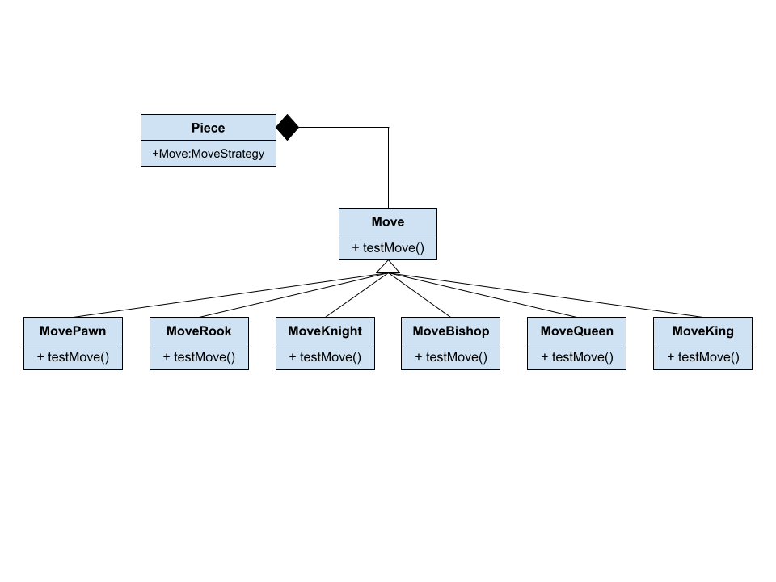
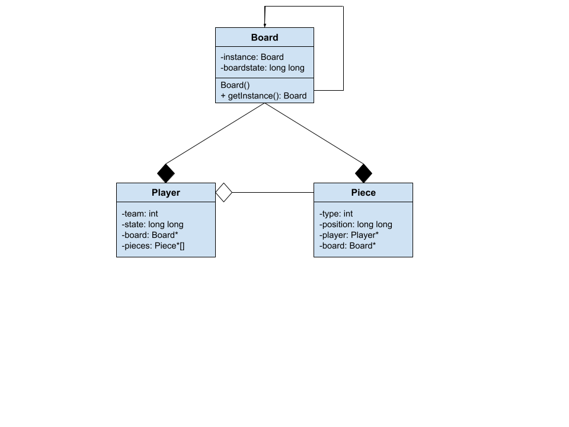

 

# Project Chess
 
 Authors: 
\[Merrick Slane](https://github.com/meslane)\, 
\[Arthur Hecker](https://github.com/aheck004)\, 
\[Tomin Kappiarumalayil](https://github.com/tominkapp)\, 
\[Daniel Boules](https://github.com/dcboules)\
 
## Project Description
- Our project is to recreate the traditional chess board and be able to play against an engine. This is very interesting to us because we find game theory and the mathematics behind it very interesting. It is also exciting to be able to work with a GUI using C++. On top of this, chess has been around for quite a while so putting it in technology is also exciting.
- Language: C++  We will be using SDL for the graphics.
     [stockfish](https://stockfishchess.org/) - Current best chess engine.
     [SDL](https://www.libsdl.org/)
- The input of the final product will be mouse strokes (click on peice and click on location), the output will be a motion and a returning move from the computer.
The two design patterns we decided on are first:
     * For the board we will use the singleton design pattern. A problem implementing could be linking all of the specific pieces to the board. The singleton will be a good solution to the board because there will never be more than one chess board in a game and it will be globally important to the operation of the game. It ensures that the board will be easily accessible to all the pieces.
     * ~~The second design pattern we will use the composite pattern. We picked it because it is a great way to have a class for each piece that all have common functions for example checking the king, or having the concept of moving. Problems that we can anticipate could be how to deal with piece collision or forcing pieces to not move while the king is in check. One way to solve this using the composite pattern is to reference the logic for these rules in a single function that can be defined and referenced in each child.~~  
     * The second design pattern we will be using is the strategy design pattern. This will allow us to assign unique movement algorithms to each piece without extending the piece class for each instance. For example, the piece class will contain a reference to a `possible_moves` class. This class in turn will refer to the unique movement strategy for each type of piece. For example, a bishop's `possible_moves` class would in turn refer to the `move_bishop` strategy.

     
 > ## Phase II
 > In addition to completing the "Class Diagram" section below, you will need to 
 > * Set up your GitHub project board as a Kanban board for the project. It should have columns that map roughly to 
 >   * Backlog, TODO, In progress, In testing, Done
 >   * You can change these or add more if you'd like, but we should be able to identify at least these.
 > * There is no requirement for automation in the project board but feel free to explore those options.
 > * Create an "Epic" (note) for each feature and each design pattern and assign them to the appropriate team member. Place these in the `Backlog` column
 > * Complete your first *sprint planning* meeting to plan out the next 7 days of work.
 >   * Create smaller development tasks as issues and assign them to team members. Place these in the `TODO` column.
 >   * These cards should represent roughly 7 days worth of development time for your team, taking you until your first meeting with the TA
## Class Diagram
 > Include a class diagram(s) for each design pattern and a description of the diagram(s). Your class diagram(s) should include all the main classes you plan for the project. This should be in sufficient detail that another group could pick up the project this point and successfully complete it. Use proper OMT notation (as discussed in the course slides). You may combine multiple design patterns into one diagram if you'd like, but it needs to be clear which portion of the diagram represents which design pattern (either in the diagram or in the description). 
 
 **Strategy design pattern for the piece class**
  
  
  **Singleton design battern for board and relationships to player and piece**
  
 
>>>>>>> 388cb6bcf8b4dd452ea6408e1452a7d1eb4b0166
 > ## Phase III
 > You will need to schedule a check-in with the TA (during lab hours or office hours). Your entire team must be present. 
 > * Before the meeting you should perform a sprint plan like you did in Phase II
 > * In the meeting with your TA you will discuss: 
 >   - How effective your last sprint was (each member should talk about what they did)
 >   - Any tasks that did not get completed last sprint, and how you took them into consideration for this sprint
 >   - Any bugs you've identified and created issues for during the sprint. Do you plan on fixing them in the next sprint or are they lower priority?
 >   - What tasks you are planning for this next sprint.

 > ## Final deliverable
 > All group members will give a demo to the TA during lab time. The TA will check the demo and the project GitHub repository and ask a few questions to all the team members. 
 > Before the demo, you should do the following:
 > * Complete the sections below (i.e. Screenshots, Installation/Usage, Testing)
 > * Plan one more sprint (that you will not necessarily complete before the end of the quarter). Your In-progress and In-testing columns should be empty (you are not doing more work currently) but your TODO column should have a full sprint plan in it as you have done before. This should include any known bugs (there should be some) or new features you would like to add. These should appear as issues/cards on your Kanban board. 
 
 ## Screenshots
 > Screenshots of the input/output after running your application
 ## Installation/Usage
 > Instructions on installing and running your application
 ## Testing
 > How was your project tested/validated? If you used CI, you should have a "build passing" badge in this README.
 
